# Learning Android Development with kotlin
 
### What I learned.
* **Object-oriented programming in Kotlin, variables, data types, functions, classes, inheritance.**
* **Control flows (if/else, when, for/while/do-while loops) .**
* **Data structures such as collections, arrays, ArrayLists etc.**
* **Networking including asynchronous API call, to retrieve live data from the cloud and store it there.**
* **Using JSON.**
* **Uisng device features such as Camera, Gallery, SQLite, GPS.**
* **Third-Party libraries such as GSON, Google Places, RETROFIT, and DEXTER.**
* **Firebase and Firestore usage.**

##### NOTE: I case you want to reuse these codes. Make sure you replace the API keys. I have disabled all of them since this is a public repository. The apps which use api calls are
* Assimilator
* Travelogue
* SimplySunny

### What Apps Do

 #### AgeInMinutes (theAgeOldApp)

* **Calculates the age in days, hours, minutes and seconds based on date picked**
* **Techniques used:**
  * Uisng kotlin classes
  * Building basic UI with one activity, button and text-views
  * Using in-built date picker
* **Screenshot**
  

 #### Calculator

* **Basic Arithemetic Calulator**
* **Techniques used:**
  * Mathematical opertaors
  * exit texts, inputs and outputs, button layouts, string handling
* **Screenshot**
  

 #### The Quiz App

* **This app is built as a basis for a classic quiz app. The questions are set on country-flags.**
* **Techniques used:**
  * Manipulating android manifest for having more than one activity
  * Creating models and user defined classes
  * Data flow between multiple activities
  * User inputs
* **Screenshots**

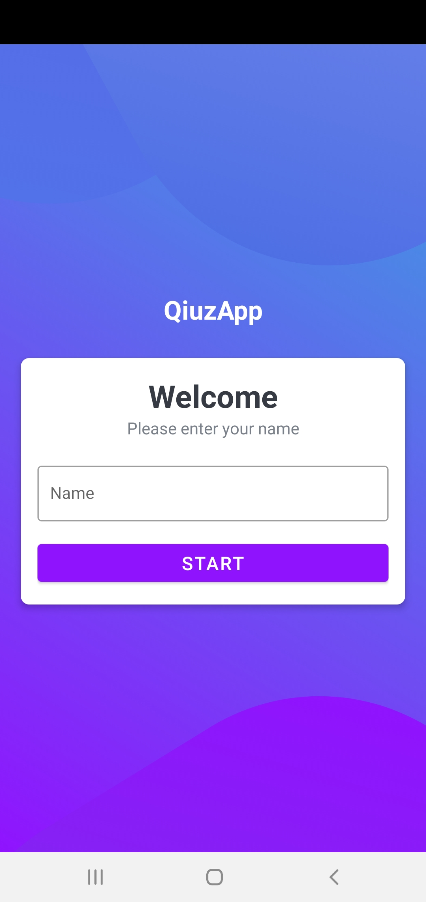
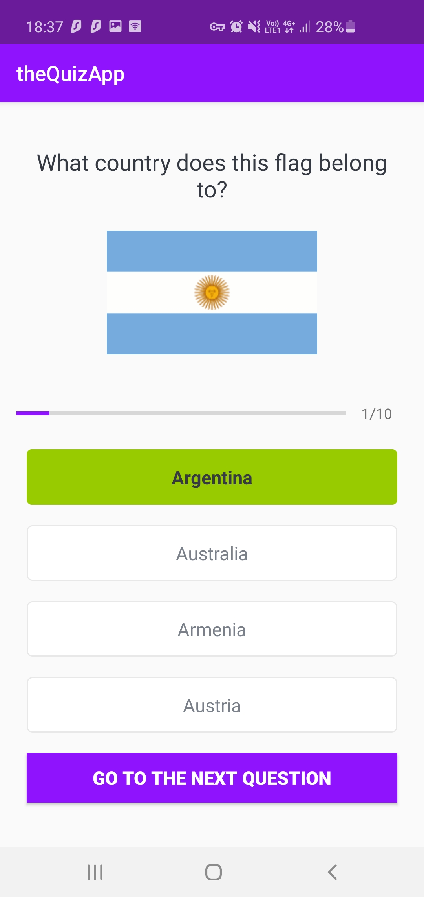
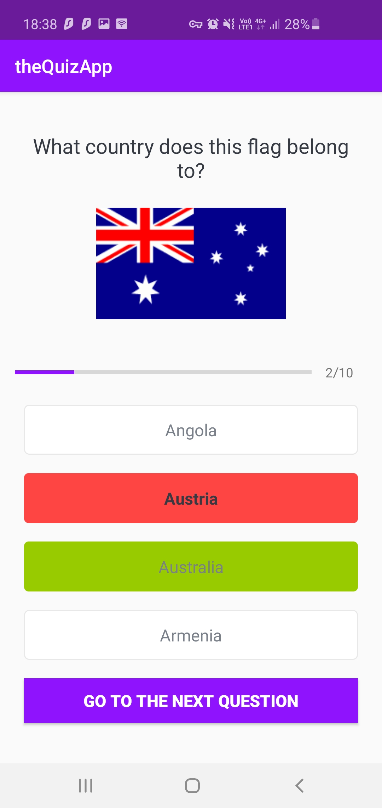

#### ProtoDraw (primitive drawing app)
* **Ability to draw in a handful of predefined colors. Features incluede changing brush size, adding a background image from gallery, undo, redo, clear all and save drawing to storage.**
* **Techniques used:**
  * Handling canvas and bitmaps
  * Device permissions for storage and media
  * Handling async tasks
  * Custom progress dailogs, snackbars and toasts
* **Screenshot**
  

#### 7 Minute Workout App
* **Workout timer for the populor 7 minute workout routine. Additional feature include BMI calculator in SI as well as imperial units and ability to story history of workouts**
* **Techniques used:**
  * Radio buttons for switching between activities
  * Local data storage using SQLite 
  * Using timers and countdown timers
  * Text to speech handling and playing sounds with media
  * Recycler Views
* **Screenshots**

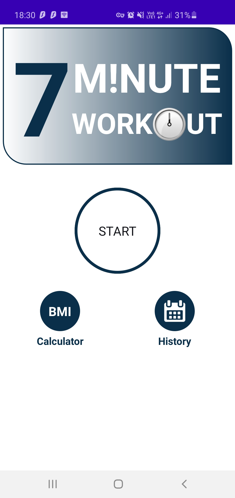
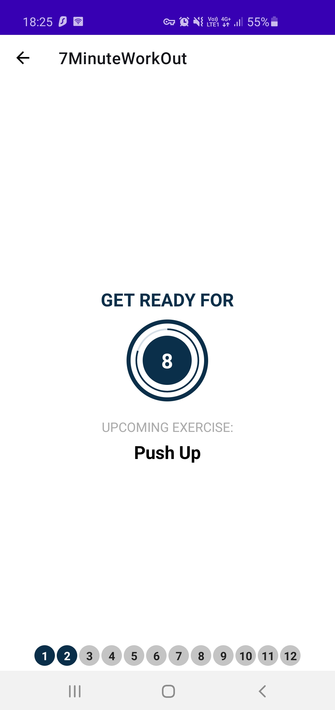

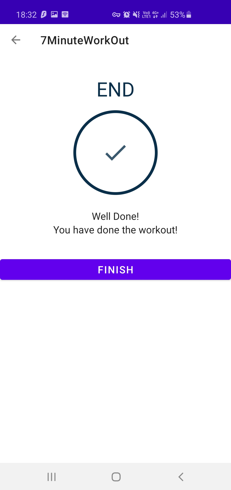
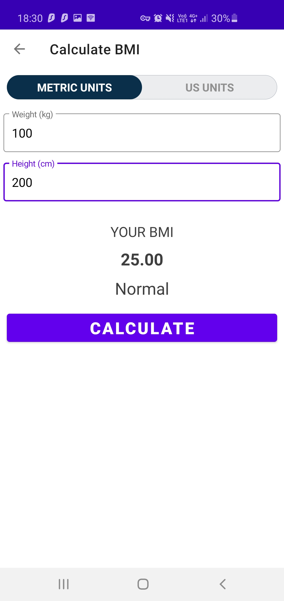

#### Travelogue (PictoLogue)
* **Journal like logue with pictures instead. Ability to write a short description, title for the picture. In addition to that, auto or manual date and location  picker. The picture can be picked from gallery or captured from the camera app directly into the app. This was a fun one to learn to make. The entries can be be edited or deleted from the main scrren with a right or left swipe on the entry respectively**
* **Techniques used:**
  * Recycler view
  * Permissions using dexter api for camera, storage and location
  * Google place api calls, Map fragments
  * Swipe actions
* **Screenshots**

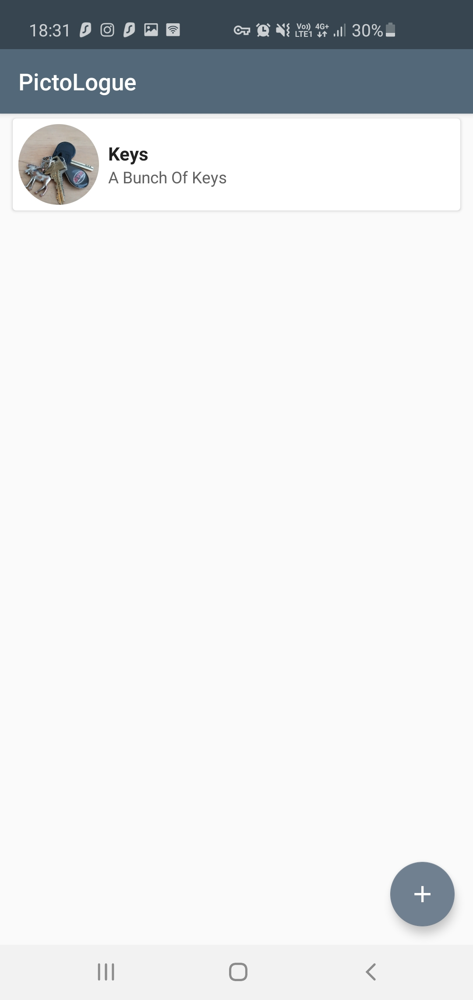
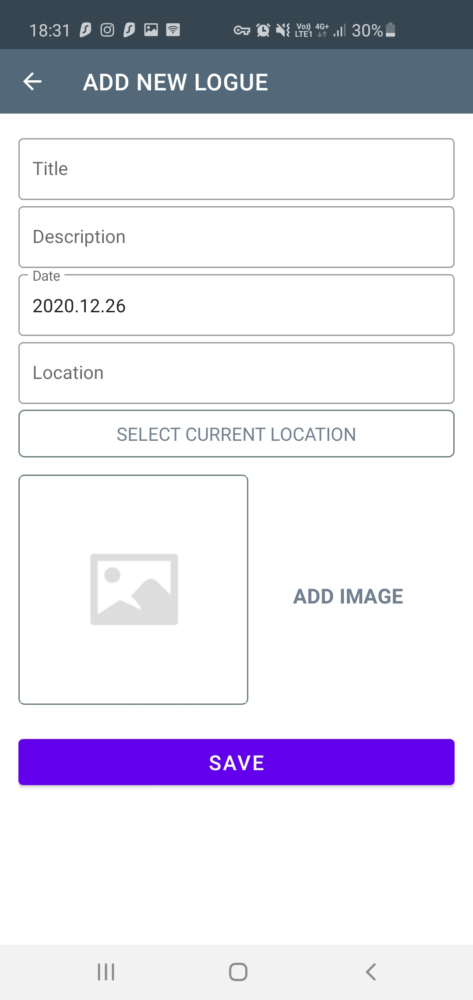

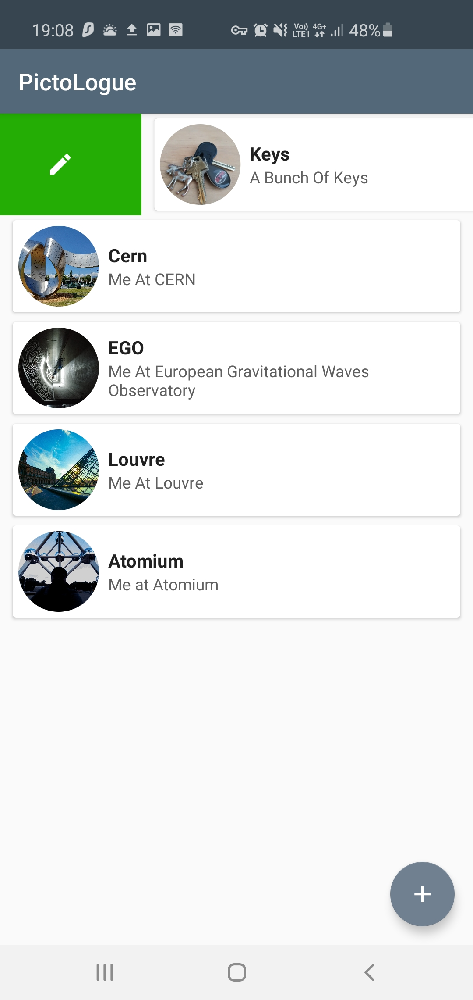
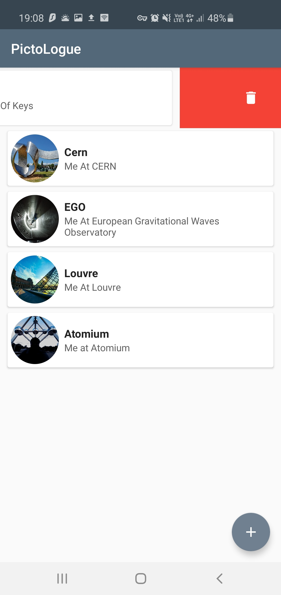

#### Simply Sunny
* **This a fun weather app that tells you what to wear beased on the weather. Right now it just askes everyone to wear my equlibrium consition get up, it should be updated to actually be useful and also show weather conditions on mars.**
* **Techniques used:**
  * Permissions for location and cellular data
  * Thirdparty api calls - open weather, google places
  * Data upload and retrieval using cellular data
  * Data retrieval using GSON in JSON format.
  * Location
* **Screenshots**
  

